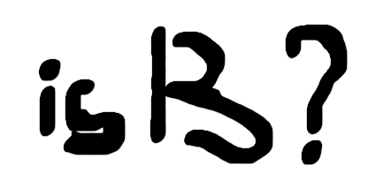

# is-thirteen

An Unity package to check if a number is equal to 13.

## Installation
### Unity Package Manager

- Open Unity and go to Window > Package Manager
- Click the + button and select Add package from git URL
- Enter: https://github.com/NamPhuThuy/Unity-Package-IsThirteen.git

### Manual Installation
- Download the package files
- Copy the **Unity-Package-IsThirteen** folder to your Assets/Scripts directory

## Usage

```c#
// Basic usage
IsThirteen.Is(13).Thirteen();           // true
IsThirteen.Is(25).Thirteen();           // false

// With roughly modifier  
IsThirteen.Is(12.8f).Roughly.Thirteen(); // true

// Within distance check
IsThirteen.Is(6).Within(10).Of.Thirteen(); // true

// Year of birth check (age would be 13 in current year)
IsThirteen.Is(2011).YearOfBirth();      // true

// Math operations - check your math skillz
IsThirteen.Is(4).Plus(5).Thirteen();      // false
IsThirteen.Is(12).Plus(1).Thirteen();     // true
IsThirteen.Is(4).Minus(12).Thirteen();    // false
IsThirteen.Is(14).Minus(1).Thirteen();    // true
IsThirteen.Is(1).Times(8).Thirteen();     // false
IsThirteen.Is(26).DivideBy(2).Thirteen(); // true

// Extension method syntax (even more elegant)
13.Is().Thirteen();                       // true
12.8f.Is().Roughly.Thirteen();           // true
```


## API Reference
### Core Methods
- IsThirteen.Is(number) - Creates an IsThirteen instance
- .Thirteen() - Checks if the number equals 13
- .Roughly - Enables approximate matching (±0.5 tolerance)
- .Within(distance).Of.Thirteen() - Checks if number is within distance of 13
- .YearOfBirth() - Checks if birth year would make someone 13 years old

### Math Operations
- .Plus(number) - Addition
- .Minus(number) - Subtraction
- .Times(number) - Multiplication
- .DivideBy(number) - Division

## Static Methods
- IsThirteen.IsThirteenNumber(number) - Direct boolean check